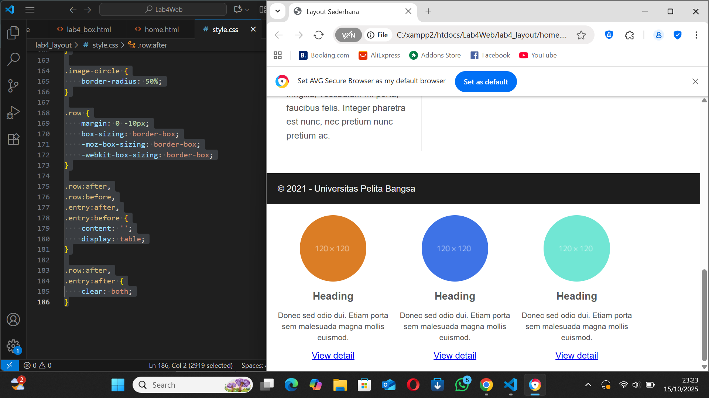

 Laporan Praktikum 4 - CSS Layout

Nama: Rafi Ubaydillah

NIM: 312410542

Kelas: TI.24.A5

Mata Kuliah: Pemrograman Web

Dosen: Agung Nugroho, S.Kom., M.Kom.

🔹 Tujuan Praktikum

Memahami struktur dasar pembuatan layout web.

Memahami konsep box element.

Memahami penggunaan CSS Float Property.

Memahami HTML5 Semantic Element.

Membuat layout web sederhana.

⚙️ Langkah-Langkah Praktikum

1️⃣ Membuat File lab4_box.html

Membuat struktur HTML dasar dengan judul Box Element.

<!DOCTYPE html>
<html lang="en">
<head>
  <meta charset="UTF-8">
  <meta name="viewport" content="width=device-width, initial-scale=1.0">
  <title>Box Element</title>
</head>
<body>
  <header>
    <h1>Box Element</h1>
  </header>
</body>
</html>

screenshot tampilan awal lab4_box.html di browser

2️⃣ Menambahkan Box Element

Menambahkan elemen 
 untuk membuat tiga box berwarna.

<section>
  
Div 1

  
Div 2

  
Div 3

</section>

hasil tampilan tiga box sejajar horizontal

3️⃣ Menambahkan Clearfix

Menambahkan 
 dengan property clear untuk mengatur posisi setelah float.

.div4 {
  background-color: blue;
  clear: left;
  float: none;
}

hasil setelah ditambahkan box keempat di bawah tiga box pertama

4️⃣ Membuat Layout Web Sederhana

Membuat folder baru lab4_layout, lalu membuat file home.html dan style.css.

Struktur HTML dasar:

  <header><h1>Layout Sederhana</h1></header>
  <nav>
    <a href="home.html" class="active">Home</a>
    <a href="artikel.html">Artikel</a>
    <a href="about.html">About</a>
    <a href="kontak.html">Kontak</a>
  </nav>
  <section id="hero"></section>
  <section id="wrapper">
    <section id="main"></section>
    <aside id="sidebar"></aside>
  </section>
  <footer>
    
&copy; 2025 - Universitas Pelita Bangsa

  </footer>

tampilan kerangka layout di browser

5️⃣ Menambahkan Navigasi, Hero Panel, dan Sidebar

Menambahkan warna dan efek hover pada navigasi.

Menambahkan bagian hero dengan teks dan tombol.

Membuat sidebar dengan widget link dan teks.

tampilan navigasi + hero panel + sidebar

6️⃣ Menambahkan Konten Utama (Main Content)

Menambahkan beberapa box konten dan artikel menggunakan <section> dan <article>.

hasil tampilan konten utama dan artikel di layout

7️⃣ Menambahkan Layout About

File: about.html

Berisi deskripsi diri dan portfolio.

tampilan halaman About

8️⃣ Menambahkan Layout Kontak

File: kontak.html

Berisi form input nama, email, dan pesan.

tampilan halaman form kontak

📄 Kesimpulan

Dalam praktikum ini saya mempelajari:

Konsep box element dan cara mengatur layout menggunakan CSS Float.

Penggunaan HTML5 semantic element seperti header, nav, section, article, footer.

Cara membuat layout web sederhana yang terstruktur dan responsif.

Cara menambahkan halaman tambahan seperti About dan Contact.
